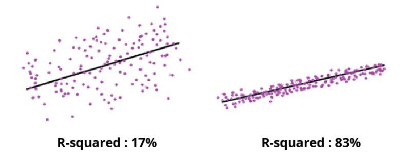

```{r setup, include=FALSE}
options(htmltools.dir.version = FALSE)
knitr::opts_chunk$set(fig.path   = "figures/",
                      fig.retina = 2,
                      warning = FALSE,
                      error = FALSE,
                      message = FALSE)


library(showtext)
library(ggplot2)
font_add_google("Pangolin", "Pangolin")
showtext_auto()

#theme for chalkboard
theme_chalk <- function () { 
  theme_minimal() %+replace% 
    theme(
      axis.ticks = element_line(colour = "white",size=0.25),
      text = element_text(colour = "white"),
      axis.text  = element_text(colour = "white",family = "Pangolin",size=18),
      axis.title  = element_text(colour = "white",family = "Pangolin",size=24),
      panel.background  = element_rect(colour = NA,fill="transparent"),
      plot.background = element_rect(colour = "white",fill="transparent"),
      legend.position = "bottom",
      legend.title = element_blank(),
      panel.grid.minor = element_blank(),
      panel.grid.major.x = element_line(colour = "white",size=0.25),
      panel.grid.major.y = element_line(colour = "white",size=0.25),
      legend.text = element_text(size = 24)
    )
}

#theme for masked plots
theme_mask <- function () { 
  theme_minimal() %+replace% 
    theme(
      axis.ticks = element_line(colour = "white",size=0.25),
      text = element_text(colour = "white"),
      axis.text  = element_text(colour = "white",family = "Pangolin",size=18),
      axis.title  = element_text(colour = "white",family = "Pangolin",size=24),
      panel.background  = element_rect(colour = NA,fill="transparent"),
      plot.background = element_rect(colour = "white",fill="transparent"),
      legend.position = "bottom",
      legend.title = element_blank(),
      panel.grid.minor = element_blank(),
      panel.grid.major.x = element_line(colour = "white",size=0.25),
      panel.grid.major.y = element_line(colour = "white",size=0.25),
      legend.text = element_text(size = 24)
    ) + 
    theme(plot.margin = margin(2, 2, 2, 2, "cm"))
}

# make all plt bg transparent
knitr::opts_chunk$set(dev.args=list(bg="transparent"))
```

# Contact Information

- Email: bchristman@umc.edu

- Phone: 610-999-4489

---

# What is Regression Analysis?


```{r testing, echo=FALSE, fig.showtext = TRUE,fig.width=12,fig.height=4,out.height="100%",fig.align="center"}
ggplot(cars, aes(speed, dist)) +
  geom_point(alpha=0.5, col="white") +  
  geom_smooth(method = "lm", se = FALSE, aes(color="Line of 'best' fit")) +
  labs(x = "Predictor", y = "Outcome") +
  theme_chalk()

```

--

- Regression analysis is a statistical method for evaluating the relationship between an outcome variable and one or more predictor variables

--

- Utility: prediction and forecasting
---
# Simple Linear Regression
- General Form: $Y = a + bX$

--

- $X$ is the predictor and $Y$ is the outcome (must be continuous)

--

- The slope of the line (regression coefficient) is $b$, and $a$ is the intercept (the value of $Y$ when $X$ = 0)

---
# Simple Linear Regression Cont. 
- Null Hypothesis: There is no association between $X$ and $Y$; i.e., $b = 0$

--

- Alternative Hypothesis: There is an association between $X$ and $Y$; i.e., $b \neq 0$

--

- Typically not causal: association $\neq$ causation

--

- Linear regression is used to determine whether there is a linear association or relationship between a continuous outcome variable and a predictor variable

---
# Pearson's Correlation Coefficient

- Denoted as $r$

--

- Measured between -1 and 1

--

- Strength (no, weak, moderate, strong, or very strong) 

--

- Direction (positive or negative)

--

```{r echo=FALSE, fig.align="center", out.width="50%"}
knitr::include_graphics("Pearson's R.png")
```

---

# Coefficient of Determination
- Denoted as $r^2$

--

- Measured between 0 and 1

--

- Determines the proportion of the variance in the outcome variable that can be explained by the predictor variable

--

```{r echo=FALSE, fig.align="center", out.width="50%"}

```

---

# Multiple Linear Regression

- General Form: $Y = a + b_1X_1 + b_2X_2 + ... + b_nX_n$

--

- $X$'s are the predictors, $n$ is the number of predictors, and $Y$ is the outcome (must be continuous)

--

- The regression coefficients are the $b$'s, and $a$ is the intercept (the value of $Y$ when all $X$'s = 0)

--

- Null Hypothesis: There is no association between the predictor variables and the outcome variable; i.e., $b_1 = b_2 = ... = b_n =  0$

--

- Alternative Hypothesis: There is an association between the predictor variables and the outcome variable; i.e., at least one $b \neq 0$

---

# Simple Logistic Regression

- General Form: $ln(\frac{p}{1-p}) = a + bX$ 

--

- The outcome must be categorical or binary 

--

- $X$ is the predictor and $ln(\frac{p}{1-p})$ is the log odds of the outcome occurring

--

- The slope of the line (regression coefficient) is $b$, and $a$ is the intercept (the value of $ln(\frac{p}{1-p})$ when $X$ = 0)

--

```{r Logistic, echo=FALSE, fig.showtext = TRUE,fig.width=9,fig.height=2.7,out.height="100%",fig.align="center"}
ggplot(mtcars, aes(x=hp, y=vs)) + 
  geom_point(alpha=.5, col="white") +
  stat_smooth(method="glm", se=FALSE, method.args = list(family=binomial)) + labs(x = "Predictor", y = "Outcome") +
  theme_chalk()

```

---

# Simple Logistic Regression Cont.

- Null Hypothesis: There is no association between the predictor variable and outcome variable; i.e., $b = 0$

--

- Alternative Hypothesis: There is an association between the predictor variable and outcome variable; i.e., $b \neq 0$

--

- Typically not causal: association $\neq$ causation

--

- Logistic regression is used to determine whether there is an association or relationship between a binary or categorical outcome variable and a predictor variable

--

- No correlation coefficient or coefficient of determination  
 
---

# Multiple Logistic Regression

- General Form: $ln(\frac{p}{1-p}) = a + b_1X_1 + b_2X_2 + ... + b_nX_n$

--

- $X$'s are the predictors, $n$ is the number of predictors, and $Y$ is the outcome (must be categorical or binary)

--

- The regression coefficients are the $b$'s, and $a$ is the intercept (the value of $ln(\frac{p}{1-p})$ when all $X$'s = 0)

--

- Null Hypothesis: There is no association between the predictor variables and the outcome variable; i.e., $b_1 = b_2 = ... = b_n =  0$

--

- Alternative Hypothesis: There is an association between the predictor variables and the outcome variable; i.e., at least one $b \neq 0$

---

# Practice Question 1

A 24-month randomized clinical trial is being conducted at a high-volume otolaryngology clinic to study a new surgical augmentation agent in sinus surgery for bilateral nasal polyposis (nasal polyps). The study is comparing the outcomes of the standard of therapy (surgical removal) with the addition of a temporary implantable agent laced with betamethasone (corticosteroid). The patients are randomized to each group and post-operative outcomes are collected including morphine equivalents for pain, presence or absence of anosmia, bleeding, and regrowth of polyps. The data are collected in 246 patients. Which of the following is the most appropriate statistical test to compare the two groups regarding anosmia?

- Unpaired t-test
- Chi-squared test
- Linear regression
- Paired t-test
- Logistic regression


---
# Practice Question 2

In a clinical investigation on the relationship between age and bmi, a researcher finds the correlation coefficient (r) to be 0.65. What does this mean?

- There is a strong, positive correlation between age and bmi
- There is no correlation between age and bmi
- The age variable explains 65% of the variability in the bmi variable
- The bmi variable explains 65% of the variability in the age variable
- More than one answer is true
---
# Practice Question 3

A study is conducted to determine the factors associated with an adverse outcome (death) following an aortic valvuloplasty. The adverse outcome is categorized into two groups (0 = no death, 1 = death). Which of the following would be the most appropriate statistical test to determine the factors associated with death following an aortic valvuloplasty?

- Unpaired t-test
- Chi-squared test
- Linear regression
- Paired t-test
- Logistic regression

---
# Additional Resources
- [Penn State University STAT 501 ](https://online.stat.psu.edu/stat501/lesson/1)
- [Penn State University STAT 462](https://online.stat.psu.edu/stat462/node/95/)
- [University of South Florida](http://faculty.cas.usf.edu/mbrannick/regression/Logistic.html)
